# BÁO CÁO BÀI TẬP LỚN
## MÔN: PHÁT TRIỂN ỨNG DỤNG TRÊN THIẾT BỊ DI ĐỘNG - TEE0419

---

# PHẦN 1: MIT APP INVENTOR

## 1.1. Giới thiệu MIT App Inventor

MIT App Inventor là công cụ lập trình trực quan dạng kéo-thả, cho phép tạo ứng dụng Android mà không cần viết code truyền thống. Giao diện gồm 2 phần chính:
- **Designer**: kéo thả các thành phần giao diện (UI)
- **Blocks**: lập trình logic bằng cách ghép các khối lệnh

---

## 1.2. Mô tả thanh công cụ & Kéo-thả thành phần

### Palette (Thanh công cụ trái)

Palette chứa các thành phần chia thành nhóm:

| Nhóm | Thành phần tiêu biểu | Công dụng |
|------|----------------------|-----------|
| User Interface | Button, Label, TextBox, Image | Hiển thị & tương tác người dùng |
| Layout | HorizontalArrangement, VerticalArrangement | Sắp xếp bố cục |
| Media | Player, Sound, Camera | Xử lý đa phương tiện |
| Connectivity | Web, ActivityStarter | Kết nối mạng, gọi Activity |
| Sensors | LocationSensor, AccelerometerSensor | Cảm biến thiết bị |

### Cách kéo-thả & thay đổi thuộc tính

1. Chọn thành phần từ **Palette** → kéo vào màn hình **Viewer**
2. Chọn thành phần trên Viewer → bảng **Properties** bên phải hiển thị các thuộc tính
3. Thay đổi: `Text`, `FontSize`, `BackgroundColor`, `Width`, `Height`, v.v.

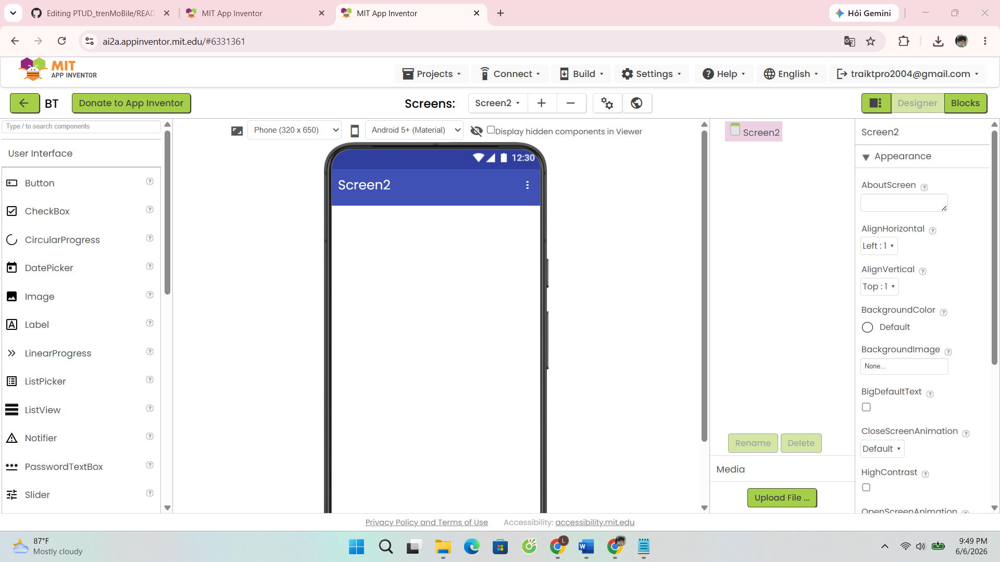

---

## 1.3. Lập trình bằng Blocks

### Bản chất kéo-thả Block

- Mỗi **Block** là một đoạn lệnh được hình-hoá thành khối màu sắc
- Ghép các khối lại với nhau = viết logic chương trình
- Không cần gõ cú pháp → tránh lỗi chính tả, lỗi cú pháp

### Ưu điểm so với viết code truyền thống

| Ưu điểm | Giải thích |
|---------|-----------|
| Trực quan | Thấy ngay cấu trúc logic qua hình dạng khối |
| Không cần nhớ cú pháp | Tránh lỗi typo, lỗi syntax |
| Phù hợp người mới | Học lập trình tư duy mà không bị cản bởi ngôn ngữ |
| Tích hợp sẵn | Kết nối UI ↔ Logic rõ ràng |

### Nhược điểm

- Khó quản lý khi dự án lớn (nhiều Block rối)
- Không linh hoạt như viết code (khó tái sử dụng, khó refactor)
- Hiệu năng thấp hơn code native

### Backpack – Copy/Paste Block

- **Backpack** là tính năng lưu tạm Block để dùng lại
- Kéo Block vào **Backpack** (góc phải màn hình Blocks)
- Chuyển sang Screen khác → kéo ra từ Backpack để dùng lại
- Tương đương Ctrl+C / Ctrl+V nhưng hoạt động xuyên Screen

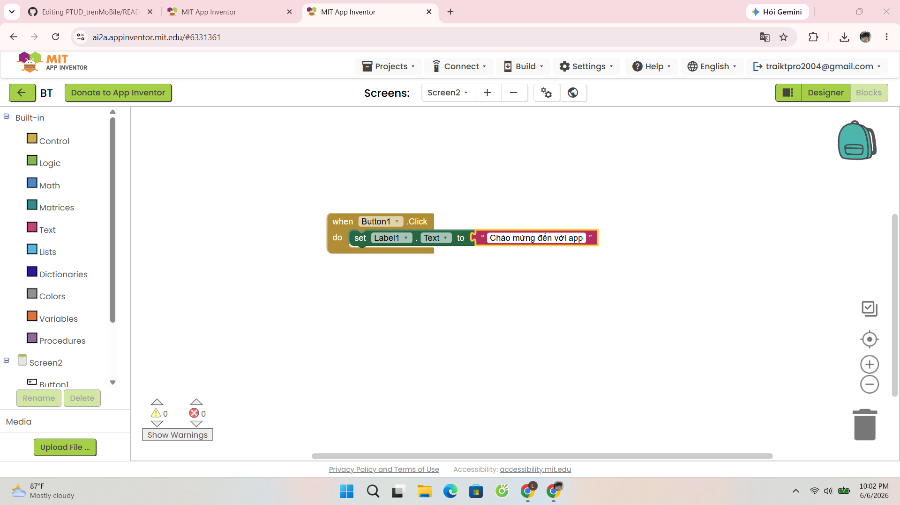

---

## 1.4. App MIT App Inventor – 3 Screen

### Screen 1: About (Giới thiệu bản thân)

**Nội dung:**
- Ảnh cá nhân (Image)
- Họ tên, MSSV, lớp (Label)
- 2 Button: "Sang Screen 2 (Giải toán)" và "Sang Screen 3 (WebView)"

**Blocks điều hướng:**

```
Khi Button1.Click
  → gọi open another screen: "Screen2"

Khi Button2.Click
  → gọi open another screen: "Screen3"
```

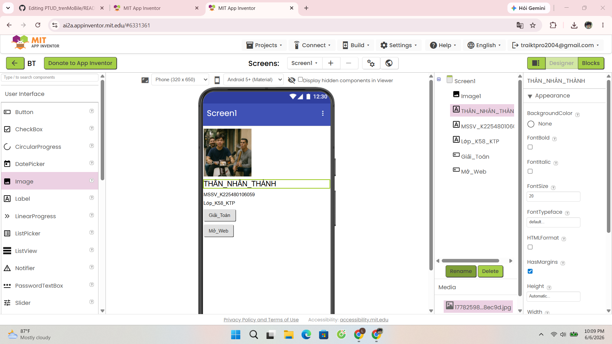

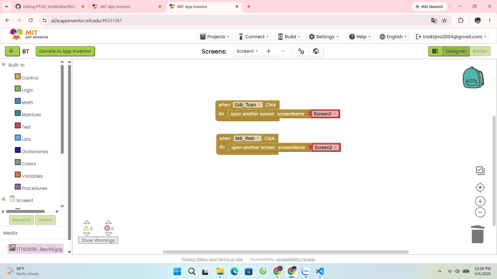

---

### Screen 2: Giải bài toán đơn giản

**Bài toán:** Tính diện tích hình chữ nhật (nhập chiều dài, chiều rộng → tính S = dài × rộng)

**Giao diện:**
- 2 TextBox nhập số
- 1 Button "Tính"
- 1 Label hiển thị kết quả

**Blocks:**

```
Khi btnTinh.Click
  → set lblKetQua.Text = TextBox1.Text × TextBox2.Text
```

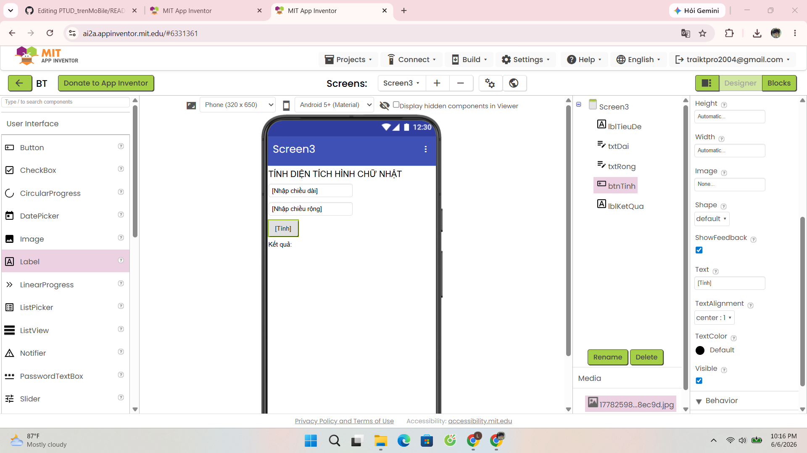

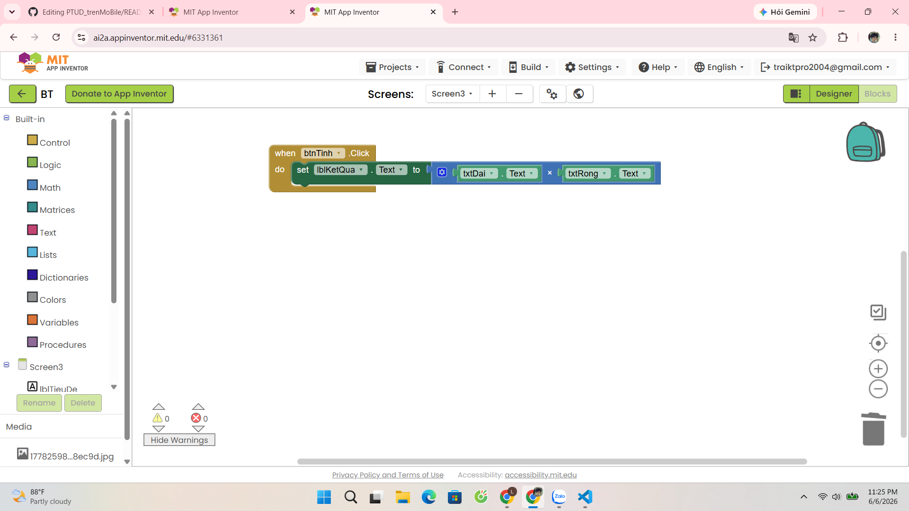

---

### Screen 3: WebView hiển thị trang web

**Trang web:** Chọn trang hỗ trợ giao diện di động, ví dụ: `https://vnexpress.net`

**Giao diện:**
- Thành phần `WebViewer` kéo vào, chiếm toàn màn hình
- Thuộc tính `HomeUrl` = địa chỉ trang web cần hiển thị

**Blocks:** Không cần block phức tạp – WebViewer tự tải trang khi mở Screen.

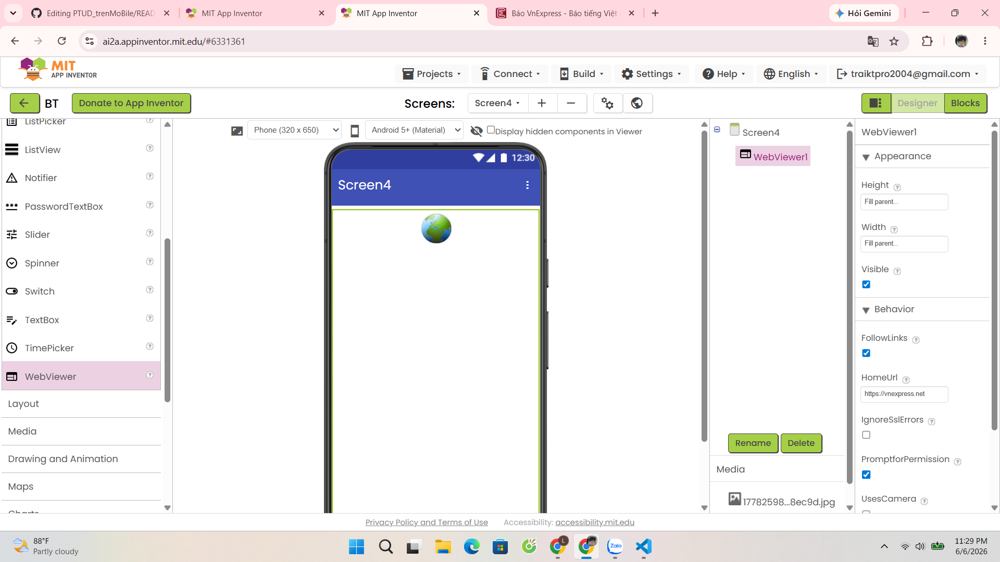

---
### Chạy trên máy thật

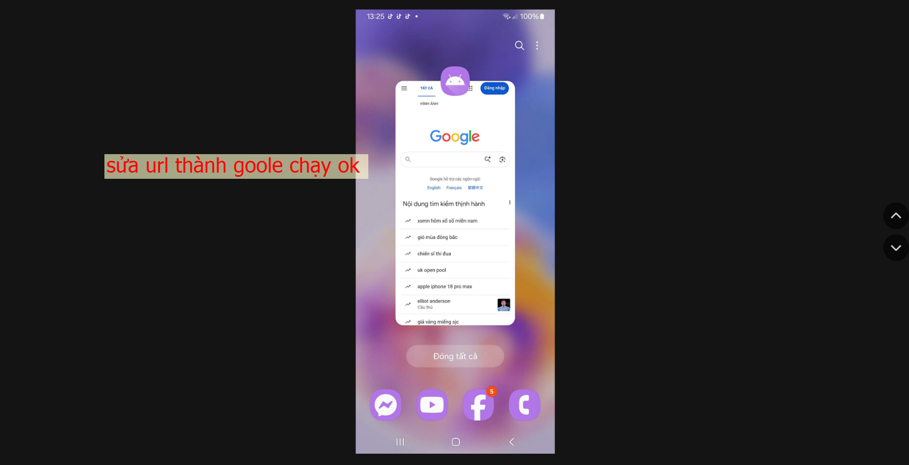
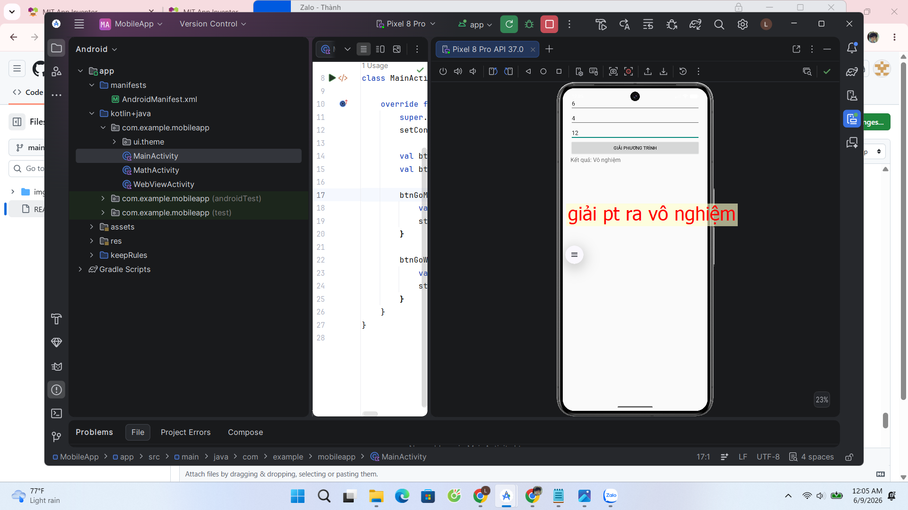
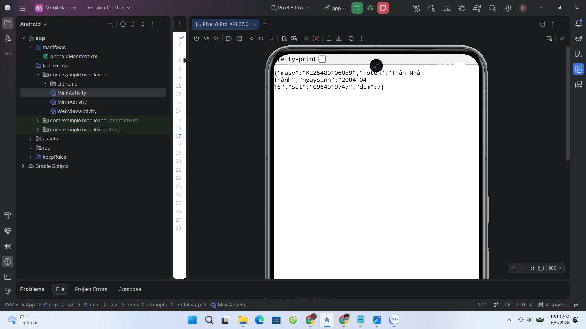
# PHẦN 2: ANDROID STUDIO

## 2.1. Android Manifest (`AndroidManifest.xml`)

### Mô tả

`AndroidManifest.xml` là file cấu hình trung tâm của ứng dụng Android, khai báo:
- Tên package, tên app, icon
- Danh sách Activity, Service, BroadcastReceiver
- **Quyền (Permission)** mà app cần

### Khai báo quyền

```xml
<!-- Khai báo trong AndroidManifest.xml -->
<uses-permission android:name="android.permission.INTERNET" />
<uses-permission android:name="android.permission.ACCESS_FINE_LOCATION" />
<uses-permission android:name="android.permission.CAMERA" />
```

**Mục đích:**
- `INTERNET`: truy cập mạng (gọi API, WebView)
- `ACCESS_FINE_LOCATION`: xác định vị trí GPS
- `CAMERA`: chụp ảnh

Từ Android 6.0+, quyền nhạy cảm (Dangerous Permission) phải **xin thêm lúc chạy** (Runtime Permission).

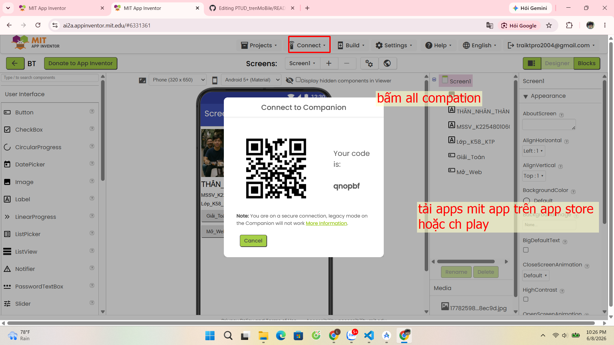

---

## 2.2. Vòng đời Activity (Activity Lifecycle)

```
onCreate() → onStart() → onResume() → [App đang chạy]
                                             ↓
                                        onPause()
                                             ↓
                              onStop() → onDestroy() [Kết thúc]
                                 ↓
                            onRestart() → onStart()
```

| Callback | Khi nào gọi | Làm gì |
|----------|-------------|--------|
| `onCreate()` | Lần đầu tạo Activity | Khởi tạo UI, biến, dữ liệu |
| `onStart()` | Activity sắp hiện | Chuẩn bị hiển thị |
| `onResume()` | Activity ở foreground | Bắt đầu animate, play media |
| `onPause()` | Mất focus | Lưu dữ liệu tạm, dừng animation |
| `onStop()` | Không còn hiển thị | Giải phóng tài nguyên nặng |
| `onDestroy()` | Activity bị hủy | Dọn dẹp toàn bộ |

### Tại sao code tự sinh có sẵn `onCreate()`?

Vì `onCreate()` là điểm vào bắt buộc của mọi Activity – Android luôn gọi nó đầu tiên. Đây là nơi duy nhất để gọi `setContentView()` để gắn layout XML vào Activity.

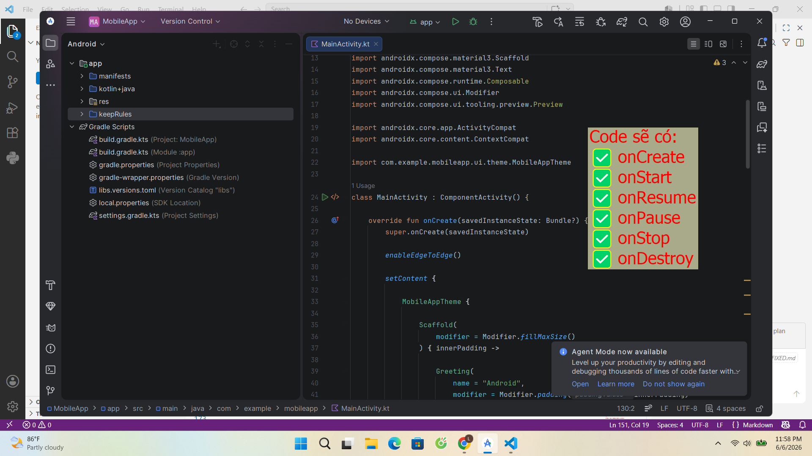

---

## 2.3. Kiểm tra và xin quyền Runtime (Java)

```java
// Kiểm tra quyền
if (ContextCompat.checkSelfPermission(this, Manifest.permission.CAMERA)
        != PackageManager.PERMISSION_GRANTED) {
    // Chưa có quyền → xin quyền
    ActivityCompat.requestPermissions(this,
            new String[]{Manifest.permission.CAMERA},
            REQUEST_CODE_CAMERA);
} else {
    // Đã có quyền → thực hiện hành động
    openCamera();
}

// Nhận kết quả xin quyền
@Override
public void onRequestPermissionsResult(int requestCode,
        String[] permissions, int[] grantResults) {
    if (requestCode == REQUEST_CODE_CAMERA) {
        if (grantResults.length > 0
                && grantResults[0] == PackageManager.PERMISSION_GRANTED) {
            openCamera(); // Người dùng đồng ý
        } else {
            Toast.makeText(this, "Quyền bị từ chối", Toast.LENGTH_SHORT).show();
        }
    }
}
```

**Ý nghĩa:** Bảo vệ quyền riêng tư người dùng – app chỉ được dùng tài nguyên khi người dùng đồng ý.

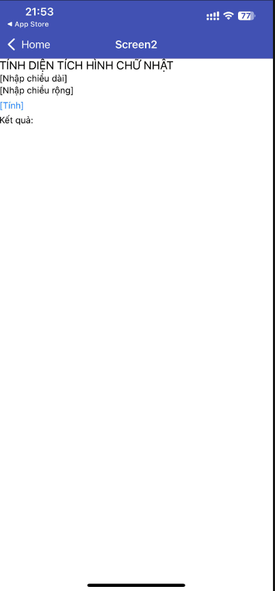

---

## 2.4. Giao diện XML Layout (`res/layout`)

### Thuộc tính hardcode vs tham chiếu tài nguyên

**❌ Hardcode (không nên):**
```xml
<TextView android:text="Xin chào" android:textSize="16sp"/>
```

**✅ Tham chiếu tài nguyên (nên dùng):**
```xml
<TextView android:text="@string/greeting" android:textSize="@dimen/text_size_normal"/>
```

**Cú pháp tham chiếu:**

| Loại | Cú pháp | File lưu |
|------|---------|---------|
| Chuỗi | `@string/tên` | `res/values/strings.xml` |
| Màu sắc | `@color/tên` | `res/values/colors.xml` |
| Kích thước | `@dimen/tên` | `res/values/dimens.xml` |
| Drawable | `@drawable/tên` | `res/drawable/` |

**Ưu điểm:**
- **Đa ngôn ngữ (Localization):** Tạo `res/values-vi/strings.xml` cho tiếng Việt, `res/values-en/strings.xml` cho tiếng Anh → Android tự chọn theo cài đặt máy
- **Đa theme:** Tạo `res/values-night/colors.xml` → tự chuyển Dark/Light mode
- **Dễ bảo trì:** Sửa 1 nơi, áp dụng toàn app

### OS hỗ trợ tự động theo:

- **LANGUAGE/LOCATION:** `res/values-vi/`, `res/values-en/`, `res/values-fr/`
- **THEME:** `res/values-night/` (Dark mode)
- **SCREEN SIZE:** `res/layout-large/`, `res/layout-sw600dp/`

→ App tự hiển thị đúng ngôn ngữ, theme, kích thước màn hình mà **không cần code thêm**.

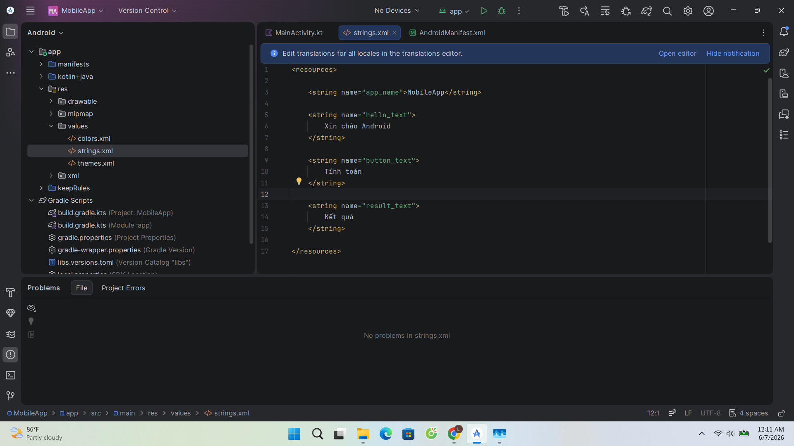

---

## 2.5. Layout Container (ViewGroup)

| ViewGroup | Sắp xếp con | Dùng khi |
|-----------|-------------|---------|
| `LinearLayout` | Ngang hoặc dọc, kề nhau | Giao diện đơn giản, tuần tự |
| `RelativeLayout` | Tương đối với nhau hoặc với parent | Cần căn chỉnh linh hoạt |
| `ConstraintLayout` | Ràng buộc nhiều chiều | Giao diện phức tạp, hiệu quả cao |
| `FrameLayout` | Chồng lên nhau | Overlay, fragment container |

**`gravity` vs `layout_gravity`:**
- `gravity`: căn nội dung **bên trong** View
- `layout_gravity`: căn View **trong parent** của nó

```xml
<LinearLayout
    android:orientation="vertical"
    android:gravity="center_horizontal">

    <Button
        android:text="@string/btn_calculate"
        android:layout_gravity="center"/>
</LinearLayout>
```

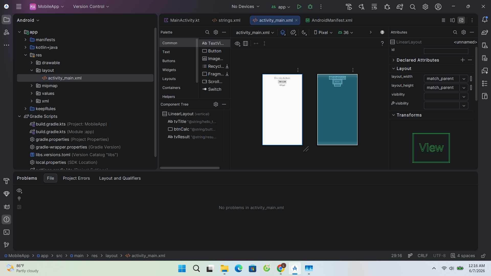

---

## 2.6. Tương tác code với layout & Localization

### Lấy View từ code (Java)

```java
// Trong onCreate()
TextView tvResult = findViewById(R.id.tvResult);
EditText etInput = findViewById(R.id.etInput);
Button btnCalc = findViewById(R.id.btnCalc);
```

### Hiển thị text theo Localization (tránh hardcode)

```java
// ❌ Sai - hardcode
tvResult.setText("Kết quả: " + result);

// ✅ Đúng - dùng string resource
tvResult.setText(getString(R.string.result_prefix) + result);

// Hoặc dùng string với placeholder
tvResult.setText(getString(R.string.result_format, result));
// strings.xml: <string name="result_format">Kết quả: %s</string>
```

→ Khi người dùng đổi ngôn ngữ máy, text tự động đổi theo.

---

## 2.7. Xử lý sự kiện (Event)

### Layout cần làm gì?

Thêm thuộc tính `android:onClick` trong XML:

```xml
<Button
    android:id="@+id/btnCalc"
    android:text="@string/btn_calculate"
    android:onClick="onCalculateClick"/>
```

### Cách 1: Khai báo trong XML + method trong Activity

```java
// Activity.java
public void onCalculateClick(View view) {
    // xử lý khi click
    String input = etInput.getText().toString();
    double result = Double.parseDouble(input) * 2;
    tvResult.setText(getString(R.string.result_format, result));
}
```

### Cách 2: Dùng `setOnClickListener` trong code (phổ biến hơn)

```java
btnCalc.setOnClickListener(new View.OnClickListener() {
    @Override
    public void onClick(View v) {
        // xử lý khi click
        String input = etInput.getText().toString();
        double result = Double.parseDouble(input) * 2;
        tvResult.setText(getString(R.string.result_format, result));
    }
});

// Hoặc viết gọn bằng Lambda (Java 8+)
btnCalc.setOnClickListener(v -> {
    String input = etInput.getText().toString();
    tvResult.setText(getString(R.string.result_format, Double.parseDouble(input) * 2));
});
```


---

## 2.8. Thư mục Assets

### Đặc điểm

- Nằm tại `app/src/main/assets/`
- Copy file/folder vào đây bằng Windows Explorer hoặc IDE
- Khi build → **mọi file đều đóng gói vào APK**, app mang theo

### Cú pháp truy cập

```java
// Đọc file text từ Assets
AssetManager assetManager = getAssets();
InputStream is = assetManager.open("data/foods.json");

// Đọc thành String
BufferedReader reader = new BufferedReader(new InputStreamReader(is));
StringBuilder sb = new StringBuilder();
String line;
while ((line = reader.readLine()) != null) {
    sb.append(line);
}
String jsonContent = sb.toString();
```

### Lợi ích

- **Offline hoàn toàn:** App hoạt động không cần mạng
- **Tốc độ:** Đọc dữ liệu nhanh, không delay mạng
- **Bảo mật:** Dữ liệu không lưu ở server ngoài

### Ứng dụng thực tế

App hướng dẫn nấu ăn, từ điển offline, app học tiếng Anh, bản đồ offline,...

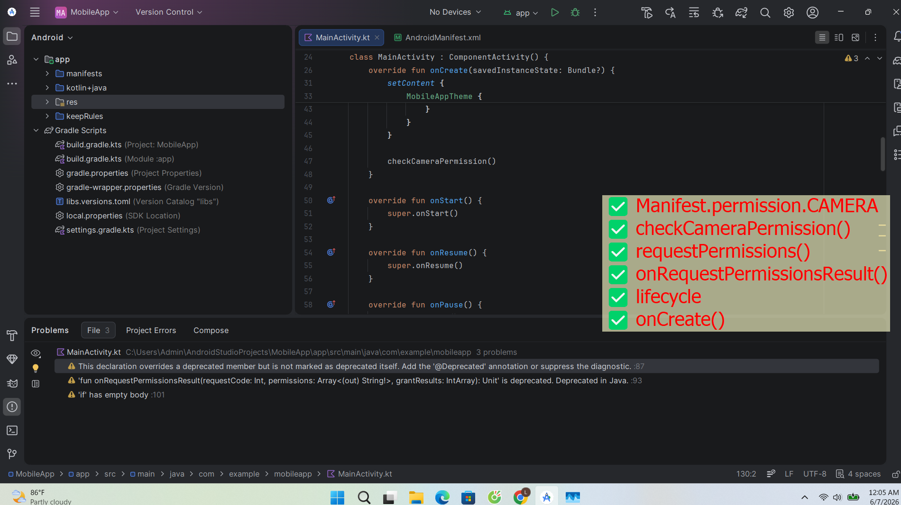

---

# PHẦN 3: APP1 – DỮ LIỆU CHUẨN BỊ TRƯỚC TRONG ASSETS

## 3.1. Đặt vấn đề

**Bài toán:** Xây dựng app **"Tra cứu món ăn Việt Nam"** – hiển thị danh sách món ăn kèm nguyên liệu và cách nấu, không cần internet.

## 3.2. Đặc thù dữ liệu

- Dữ liệu: file `foods.json` trong Assets
- Cấu trúc:

```json
[
  {
    "id": 1,
    "name": "Phở bò",
    "ingredients": ["xương bò", "bánh phở", "hành tây", "gừng", "gia vị"],
    "steps": ["Hầm xương 3 tiếng", "Chần bánh phở", "Xếp thịt, chan nước dùng"],
    "image": "pho_bo.jpg"
  },
  {
    "id": 2,
    "name": "Bún bò Huế",
    "ingredients": ["bún", "thịt bò", "chả cua", "sả", "mắm ruốc"],
    "steps": ["Nấu nước dùng", "Chần bún", "Chan và trang trí"],
    "image": "bun_bo_hue.jpg"
  }
]
```

## 3.3. Thuật toán xử lý

1. Đọc `foods.json` từ Assets → String
2. Parse JSON bằng `JSONArray` / `Gson`
3. Đổ dữ liệu vào `List<Food>`
4. Hiển thị bằng `RecyclerView`

## 3.4. Đối tượng hiển thị

- `RecyclerView` + `RecyclerView.Adapter`: hiển thị danh sách
- Khi click item → mở `DetailActivity` truyền dữ liệu qua `Intent`

```java
// Đọc JSON từ Assets
private String loadJSONFromAssets(String fileName) throws IOException {
    AssetManager am = getAssets();
    InputStream is = am.open(fileName);
    int size = is.available();
    byte[] buffer = new byte[size];
    is.read(buffer);
    is.close();
    return new String(buffer, StandardCharsets.UTF_8);
}

// Parse và hiển thị
String json = loadJSONFromAssets("foods.json");
Gson gson = new Gson();
List<Food> foodList = gson.fromJson(json,
        new TypeToken<List<Food>>(){}.getType());
adapter = new FoodAdapter(foodList);
recyclerView.setAdapter(adapter);
```

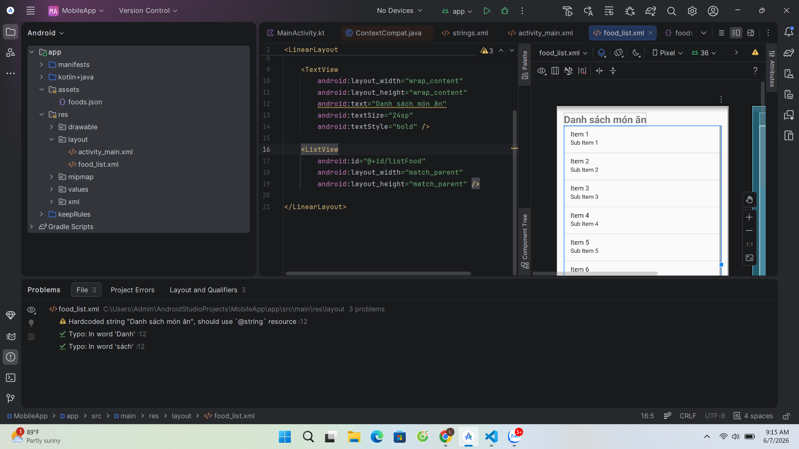


---

# PHẦN 4: APP2 – ANDROID STUDIO (3 ACTIVITY)

## 4.1. Activity 1: About

**Giao diện:** Tương tự Screen 1 MIT App Inventor – ảnh, tên, MSSV, 2 Button điều hướng.

```java
// Điều hướng sang Activity2
btnGoMath.setOnClickListener(v -> {
    Intent intent = new Intent(this, MathActivity.class);
    startActivity(intent);
});

// Điều hướng sang Activity3
btnGoWeb.setOnClickListener(v -> {
    Intent intent = new Intent(this, WebViewActivity.class);
    startActivity(intent);
});
```

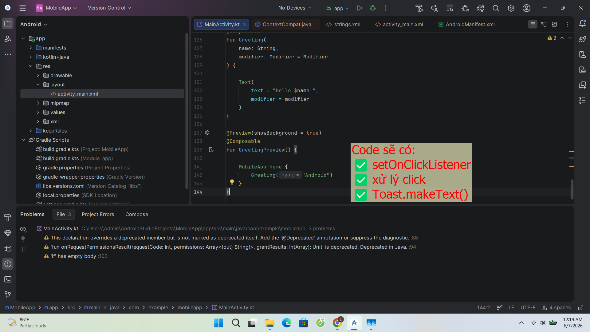

---

## 4.2. Activity 2: Giải toán + Gọi API

**Bài toán:** Giải phương trình bậc 2: ax² + bx + c = 0

### Giao diện

- 3 EditText nhập a, b, c
- 1 Button "Giải"
- 1 TextView hiển thị kết quả
- 1 TextView hiển thị phản hồi từ server

### Code giải toán

```java
double a = Double.parseDouble(etA.getText().toString());
double b = Double.parseDouble(etB.getText().toString());
double c = Double.parseDouble(etC.getText().toString());

double delta = b * b - 4 * a * c;
String ketluan, nghiem1 = "", nghiem2 = "";

if (delta < 0) {
    ketluan = "Vô nghiệm";
} else if (delta == 0) {
    ketluan = "Nghiệm kép";
    nghiem1 = String.valueOf(-b / (2 * a));
} else {
    ketluan = "Hai nghiệm phân biệt";
    nghiem1 = String.valueOf((-b + Math.sqrt(delta)) / (2 * a));
    nghiem2 = String.valueOf((-b - Math.sqrt(delta)) / (2 * a));
}

tvResult.setText(getString(R.string.result_ketluan, ketluan));
```

### Gọi API sau khi giải

```java
private void sendResultToAPI(double a, double b, double c,
                              String ketluan, double nghiem) {
    // Khai báo INTERNET permission trong Manifest trước
    new Thread(() -> {
        try {
            URL url = new URL("https://k58kmt.tdh.io.vn/api");
            HttpURLConnection conn = (HttpURLConnection) url.openConnection();
            conn.setRequestMethod("POST");
            conn.setRequestProperty("Content-Type", "application/json");
            conn.setDoOutput(true);

            // Tạo JSON body
            JSONObject input = new JSONObject();
            input.put("a", a);
            input.put("b", b);
            input.put("c", c);
            input.put("name", "Phuong trinh bac 2");

            JSONObject output = new JSONObject();
            output.put("ketluan", ketluan);
            output.put("nghiem", nghiem);

            JSONObject body = new JSONObject();
            body.put("app_by", "MSSV_CUA_BAN");  // thay bằng MSSV thực
            body.put("input", input);
            body.put("output", output);

            // Gửi request
            OutputStream os = conn.getOutputStream();
            os.write(body.toString().getBytes(StandardCharsets.UTF_8));
            os.close();

            // Đọc response
            InputStream is = conn.getInputStream();
            BufferedReader reader = new BufferedReader(new InputStreamReader(is));
            StringBuilder sb = new StringBuilder();
            String line;
            while ((line = reader.readLine()) != null) sb.append(line);

            JSONObject response = new JSONObject(sb.toString());
            int ok = response.getInt("ok");
            int stt = response.getInt("stt");

            // Cập nhật UI trên main thread
            runOnUiThread(() ->
                tvApiResponse.setText("API OK=" + ok + " | STT=" + stt));

        } catch (Exception e) {
            runOnUiThread(() ->
                tvApiResponse.setText("Lỗi gọi API: " + e.getMessage()));
        }
    }).start();
}
```

**Khai báo quyền INTERNET trong `AndroidManifest.xml`:**

```xml
<uses-permission android:name="android.permission.INTERNET"/>
```

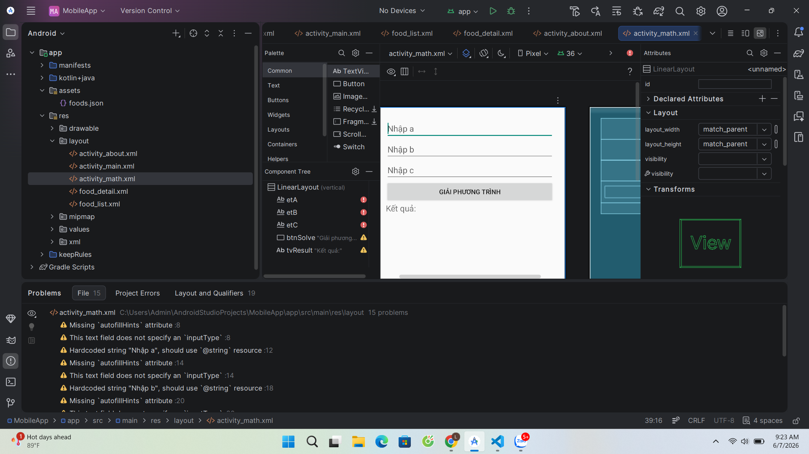

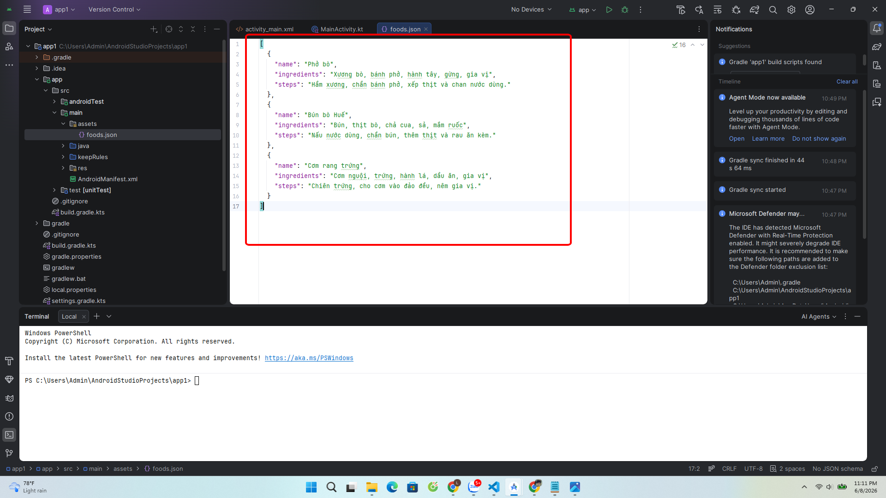

---

## 4.3. Activity 3: WebView

### Khai báo trong Manifest

```xml
<uses-permission android:name="android.permission.INTERNET"/>
```

### Layout (`activity_webview.xml`)

```xml
<WebView
    android:id="@+id/webView"
    android:layout_width="match_parent"
    android:layout_height="match_parent"/>
```

### Code Java

```java
public class WebViewActivity extends AppCompatActivity {
    private WebView webView;

    @Override
    protected void onCreate(Bundle savedInstanceState) {
        super.onCreate(savedInstanceState);
        setContentView(R.layout.activity_webview);

        webView = findViewById(R.id.webView);

        // Bật JavaScript (bắt buộc cho hầu hết trang web)
        webView.getSettings().setJavaScriptEnabled(true);
        webView.getSettings().setDomStorageEnabled(true);

        // Mở trong WebView, không mở trình duyệt ngoài
        webView.setWebViewClient(new WebViewClient());

        // Load URL với mã SV
        String masv = "MSSV_CUA_BAN"; // thay bằng MSSV thực
        webView.loadUrl("https://k58kmt.tdh.io.vn?masv=" + masv);
    }

    // Xử lý nút Back để duyệt lịch sử web
    @Override
    public void onBackPressed() {
        if (webView.canGoBack()) {
            webView.goBack();
        } else {
            super.onBackPressed();
        }
    }
}
```

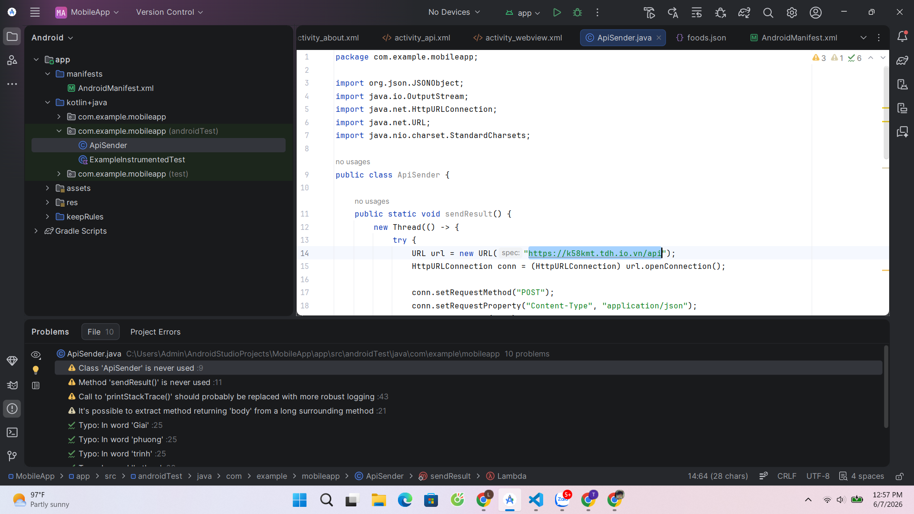
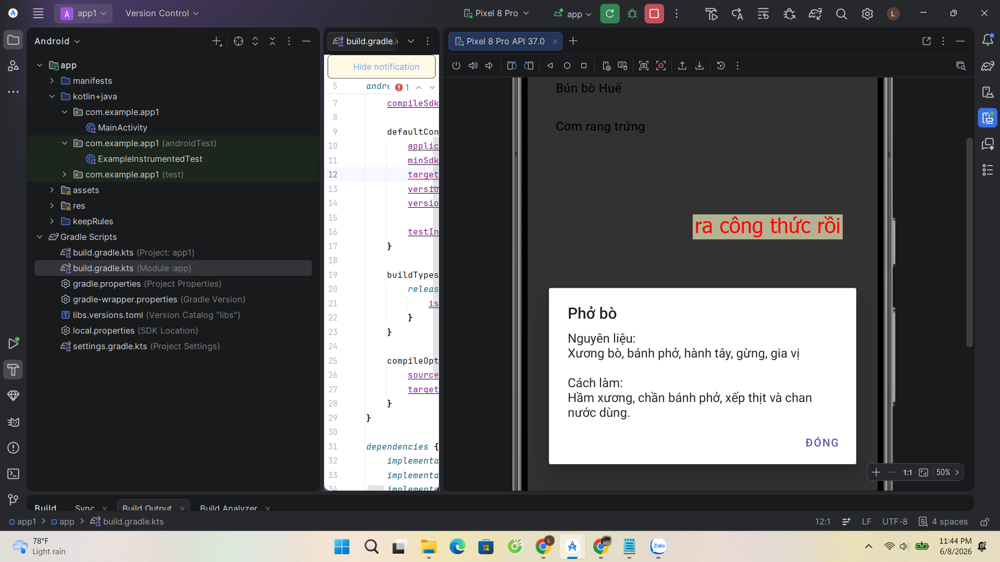

---
### demo máy thật
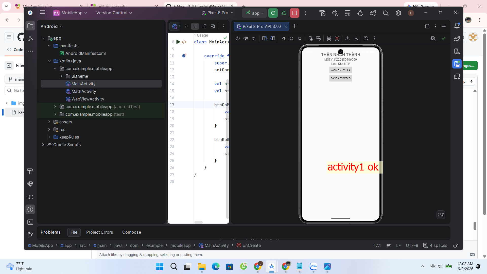
